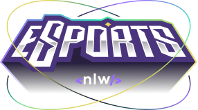
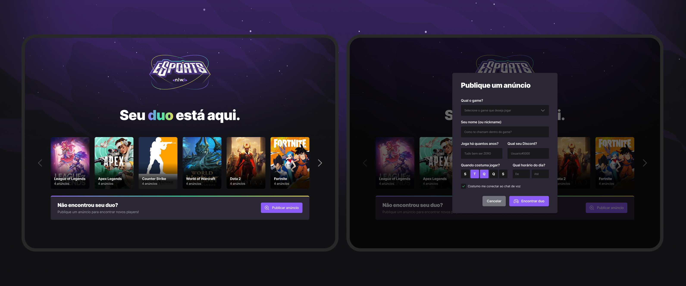
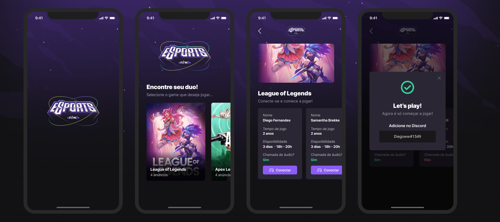

	
	<h1>eSports-Duo-Finder</h1>
	
This is a project created during Rocketseat!'s <Next Level Week>.

With 2 front applications, Web and Mobile and a server in NodeJs, this project creates a platform where you can search for a duo for a specific game or create a new ad with your discord user.

<h1>Web</h1>

<h3><strong>Uses:</strong></h3>

- React
- TypeScript
- Axios
- TailwindCss
- Radix-UI
- Vite
- PostCSS
- Phosphor-react

<h2>Preview:</h2>

<h1>Mobile</h1>

<h3><strong>Uses:</strong><h3>

- ReactNative
- TypeScript
- Expo
- Phosphor-react-native

<h2>Preview:</h2>

<h1>Server side</h1>

<h3><strong>Uses:</strong><h3>

- NodeJs
- TypeScript
- Express
- Cors
- Prisma

## 📝 License
All projects are licensed under the MIT License.

